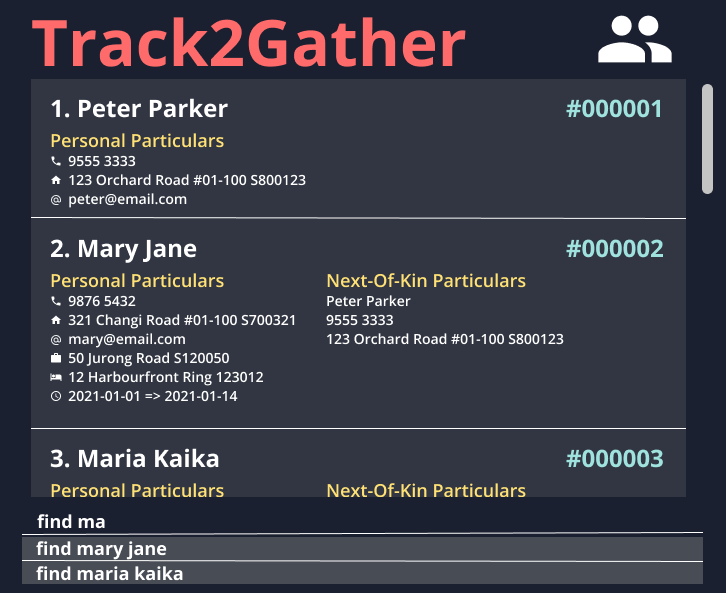

 

* Track2Gather is an app that will manage up to a few thousand contacts, providing basic features for contact tracing
  personnel to organise and search through them via:
    * personal information (limited to English names and Singaporean contact numbers and addresses)
    * case contacts
    * quarantine period
* For the detailed documentation of this project, see
  the **[Track2Gather Website](https://ay2122s1-cs2103-w14-2.github.io/tp/)**.
* This project is based on the AddressBook-Level3 project created by the [SE-EDU initiative](https://se-education.org).
