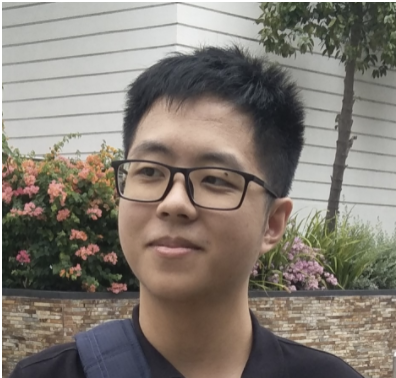
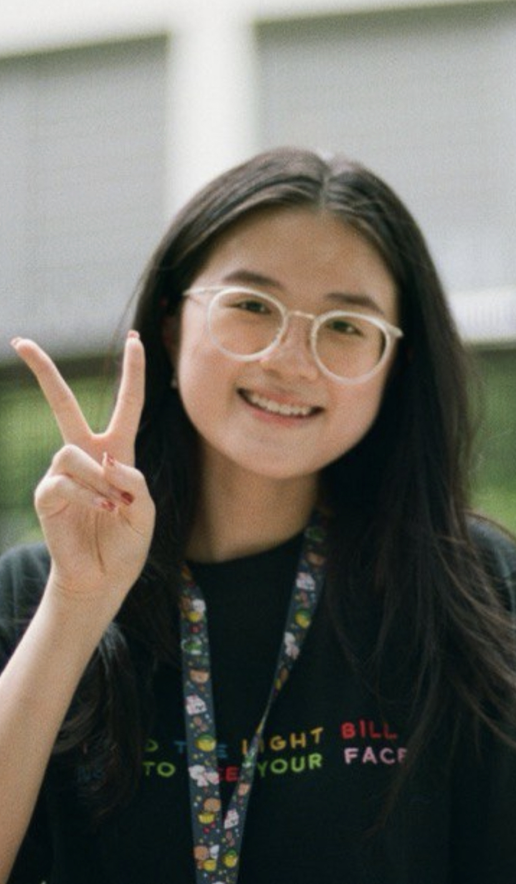
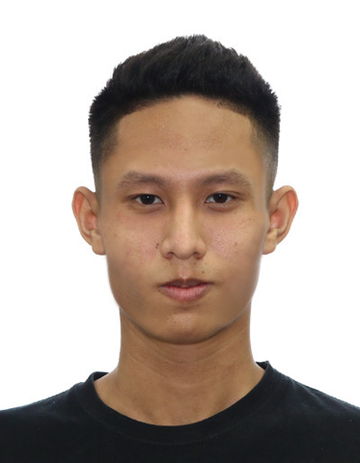
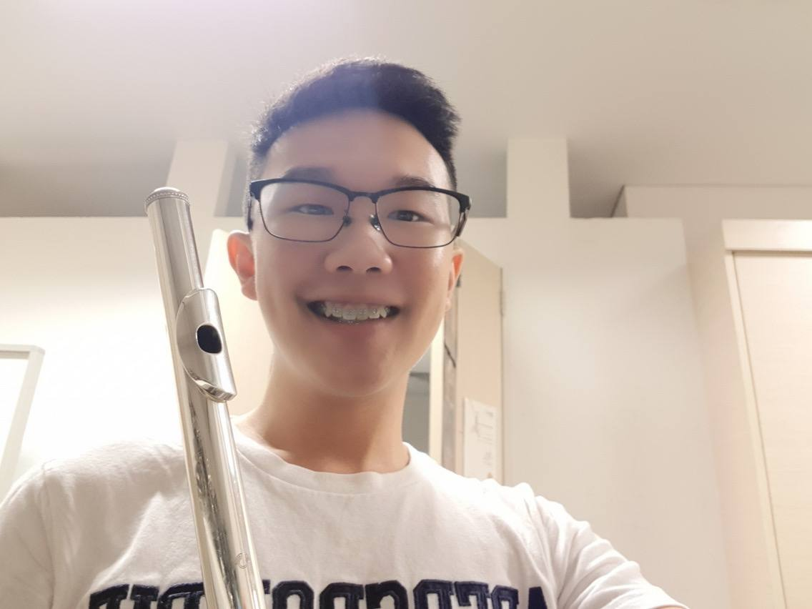
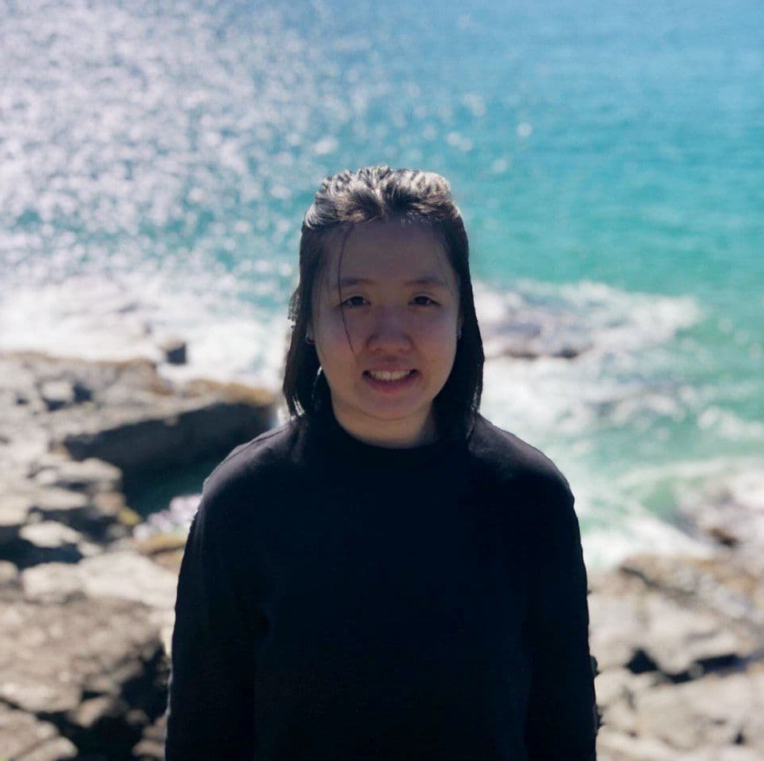

| layout | title
| --- | --- |
| page | About Us
---

We are a team based in the [School of Computing, National University of Singapore](http://www.comp.nus.edu.sg).

You can reach us at the email `seer[at]comp.nus.edu.sg`

## Project team

### Ian Yong

[[homepage](http://www.comp.nus.edu.sg/~damithch)]
[[github](https://github.com/ianyong)]
[[portfolio](team/ianyong.md)]

* Role: Project Advisor

### Lauren Shak

[[github](http://github.com/lrnshk)]
[[portfolio](team/lrnshk.md)]

* Role: Team Lead
* Responsibilities: Scheduling

### Lutfi Randiva

[[github](http://github.com/luffingluffy)] [[portfolio](team/luffingluffy.md)]

* Role: Developer
* Responsibilities: UI, Scheduling and Deliverables

### Frederick Pek

[[github](http://github.com/frederickpek)]
[[portfolio](team/frederickpek.md)]

* Role: Developer
* Responsibilities: Documentation and JavaFX

### Andrew Sutjipto

[[github](http://github.com/over-fitted)]
[[portfolio](team/andrew.md)]

* Role: Developer
* Responsibilities: Git and Testing

### Jennifer

[[github](http://github.com/jennibearduit)]
[[portfolio](team/jennibearduit.md)]

* Role: Developer
* Responsibilities: Coding Standard
